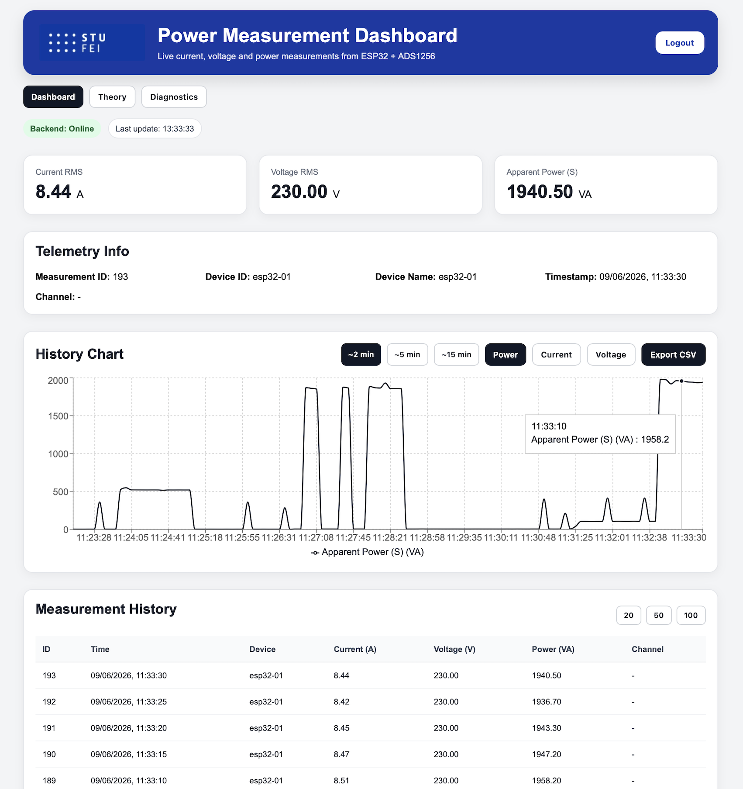
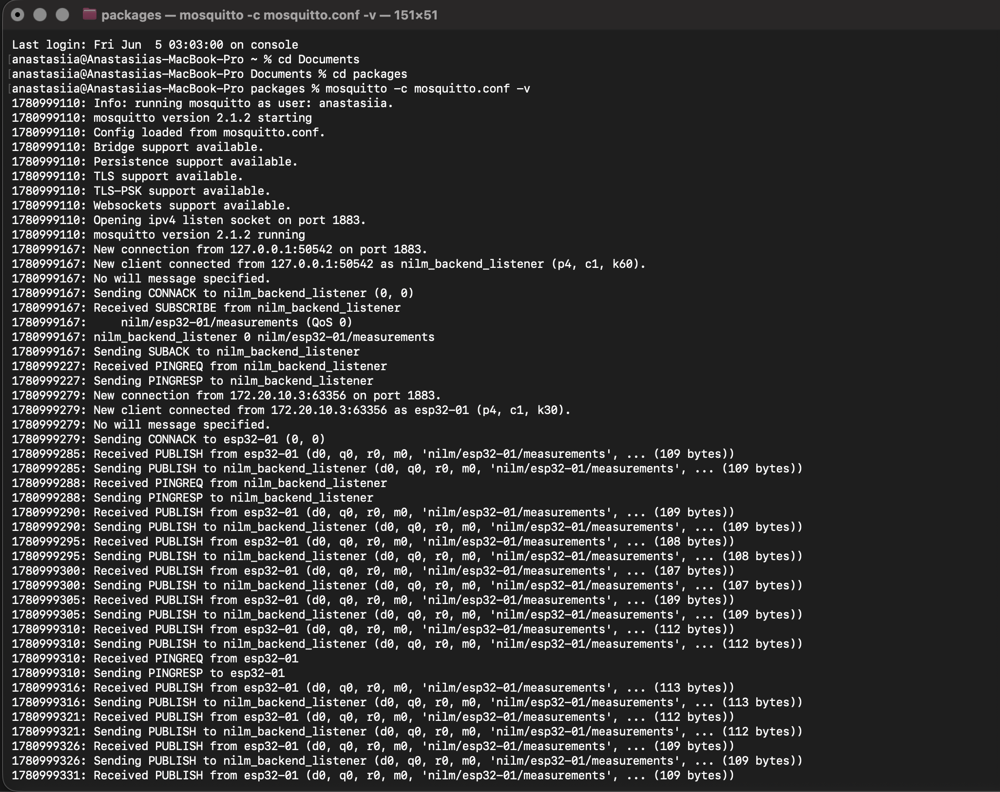

# NILM Host

## Overview

NILM Host is a small local system for collecting and displaying electrical measurement data from an ESP32-based device. The project connects an ESP32 + ADS1256 firmware sketch, an MQTT broker, a FastAPI backend, a SQLite database, and a React dashboard.

The current version is focused on telemetry collection and visualization. It does not perform appliance disaggregation yet, but it prepares the data flow that can be used later for NILM experiments.

## Project Parts

- `firmware/esp32_nilm_sim` - ESP32 firmware for reading current measurements and publishing telemetry over MQTT.
- `backend` - FastAPI service that receives MQTT data, stores measurements in SQLite, and exposes REST endpoints.
- `frontend/nilm-frontend` - React dashboard for login, live telemetry, history, and CSV export.
- `data` - local database and exported measurement data.
- `docs/screenshots` - screenshots used for project documentation.

## Data Flow

```text
ESP32 + ADS1256
    |
    | MQTT: nilm/esp32-01/measurements
    v
MQTT broker
    |
    v
FastAPI backend
    |
    v
SQLite database
    |
    v
React dashboard
```

The firmware publishes one measurement message per second. The backend subscribes to the MQTT topic, parses the payload, creates or updates the device record, and stores the measurement. The frontend reads the backend API every few seconds and shows the latest values and measurement history.

## Screenshots

Dashboard:



MQTT telemetry:



## Repository Structure

```text
.
├── README.md
├── data/
│   └── nilm.db                  # SQLite database file already present in the repo
├── backend/
│   ├── requirements.txt         # Python dependencies
│   ├── run.py                   # uvicorn launcher
│   ├── tests/
│   │   └── test_auth_passwords.py
│   └── app/
│       ├── auth.py              # password hashing and JWT creation
│       ├── config.py            # hard-coded app configuration
│       ├── crud.py              # DB access helpers
│       ├── database.py          # SQLAlchemy engine/session/base
│       ├── init_db.py           # schema creation
│       ├── main.py              # FastAPI app and startup lifecycle
│       ├── models.py            # SQLAlchemy models
│       ├── mqtt_listener.py     # MQTT subscription and DB ingestion
│       ├── schemas.py           # Pydantic schemas
│       ├── routes/
│       │   ├── auth_routes.py
│       │   ├── device_routes.py
│       │   ├── measurement_routes.py
│       │   └── stats_routes.py
│       └── services/
│           ├── measurement_service.py  # currently empty
│           └── stats_service.py        # currently empty
└── frontend/
    └── nilm-frontend/
        └── src/
            ├── App.jsx
            ├── api.js
            ├── components/
            │   └── Dashboard.jsx
            └── main.jsx
firmware/
└── esp32_nilm_sim/
    ├── esp32_nilm_sim.ino       # main firmware loop
    ├── ADS1256Driver.*          # ADC driver
    ├── CurrentSensor.*          # RMS current calculation
    ├── VoltageSensor.*          # voltage stub
    ├── PowerMetrics.*           # apparent power helper
    ├── Connectivity.*           # Wi-Fi, NTP, MQTT publishing
    ├── config.h                 # hardware and measurement constants
    └── secrets.h                # Wi-Fi / MQTT credentials and topic
```

## Requirements

- Python 3.10+
- Node.js and npm
- MQTT broker, for example Mosquitto
- Arduino IDE or PlatformIO for flashing the ESP32 firmware

The backend uses SQLite through Python, so no separate database server is required.

## Backend Setup

From the project root:

```bash
cd backend
python -m venv .venv
source .venv/bin/activate
pip install -r requirements.txt
uvicorn app.main:app --host 127.0.0.1 --port 8001
```

The backend runs at:

```text
http://127.0.0.1:8001
```

Health check:

```text
http://127.0.0.1:8001/health
```

## MQTT Broker

The backend currently expects the broker at:

```text
127.0.0.1:1883
```

Default topic:

```text
nilm/esp32-01/measurements
```

On macOS with Homebrew:

```bash
brew install mosquitto
brew services start mosquitto
```

For a temporary local broker:

```bash
mosquitto -p 1883
```

## Frontend Setup

Open a second terminal:

```bash
cd frontend/nilm-frontend
npm install
npm run dev
```

The Vite development server usually starts at:

```text
http://localhost:5173
```

By default, the frontend uses:

```text
http://127.0.0.1:8001
```

If the backend runs somewhere else, create `frontend/nilm-frontend/.env`:

```bash
VITE_API_BASE_URL=http://127.0.0.1:8001
```

## Firmware Setup

Open this sketch in Arduino IDE or PlatformIO:

```text
firmware/esp32_nilm_sim/esp32_nilm_sim.ino
```

Before flashing, check:

- `firmware/esp32_nilm_sim/secrets.h` for Wi-Fi, MQTT host, port, topic, and device ID.
- `firmware/esp32_nilm_sim/config.h` for ADS1256 pins, current transformer calibration, sample count, and fallback voltage.

When the ESP32 is used with a broker running on a computer, `MQTT_HOST` must be the computer's local network IP address. It should not be `127.0.0.1`, because on the ESP32 that address points back to the ESP32 itself.

After flashing, open the serial monitor at `115200` baud and check Wi-Fi connection, time synchronization, MQTT connection, and telemetry publishing logs.

## Test Without ESP32

The backend can be tested by publishing one MQTT message manually:

```bash
mosquitto_pub -h 127.0.0.1 -p 1883 -t nilm/esp32-01/measurements -m '{"device":"esp32-01","timestamp":"2026-06-09T12:00:00Z","i_rms":0.42,"v_rms":230.0,"s_est_va":96.6,"channel_current":"AIN0-AIN1"}'
```

Then open:

```text
http://127.0.0.1:8001/measurements/latest
```

If the response contains the measurement, MQTT ingestion, database storage, and the API are working.

## API Endpoints

- `GET /` - basic backend status message.
- `GET /health` - backend, MQTT, and database status.
- `POST /auth/register` - create a user account.
- `POST /auth/login` - login with JSON credentials.
- `POST /auth/login-form` - login with OAuth2 form data.
- `GET /devices/` - list known devices.
- `GET /devices/{device_id}` - get one device.
- `GET /measurements/latest` - get the newest measurement.
- `GET /measurements/history?limit=50` - get recent measurements.
- `GET /stats/dashboard?device_id=esp32-01` - get dashboard statistics.

## Measurement Fields

The backend accepts firmware-style fields:

- `device` or `device_id`
- `timestamp`
- `i_rms`
- `v_rms` or `voltage_rms`
- `s_est_va`
- `channel_current`

It also accepts generic names such as `current`, `voltage`, `power`, and `channel`.

The exported measurement table is stored in:

```text
data/raw/measurements_history-2026-06-09.csv
```

## Notes

- The voltage sensor class is currently a stub. If it returns a value close to zero, the firmware uses the configured nominal voltage from `config.h` to estimate apparent power.
- Runtime values in `secrets.h` should be changed for the local Wi-Fi and MQTT setup before flashing.
- `data/nilm.db` is a local SQLite database used by the backend during development.